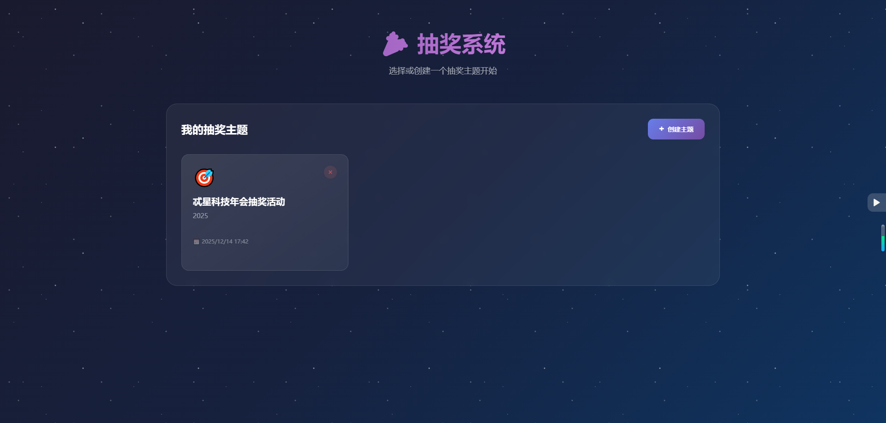
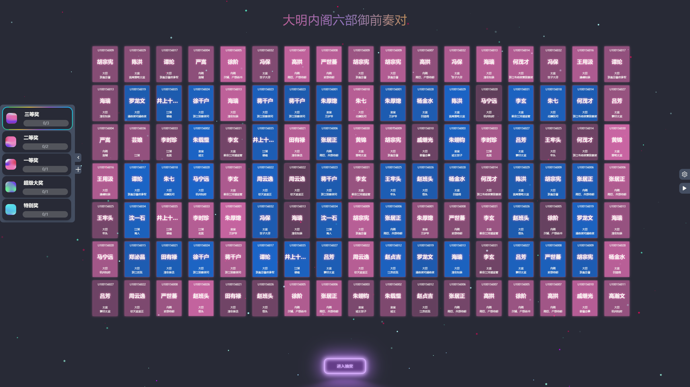
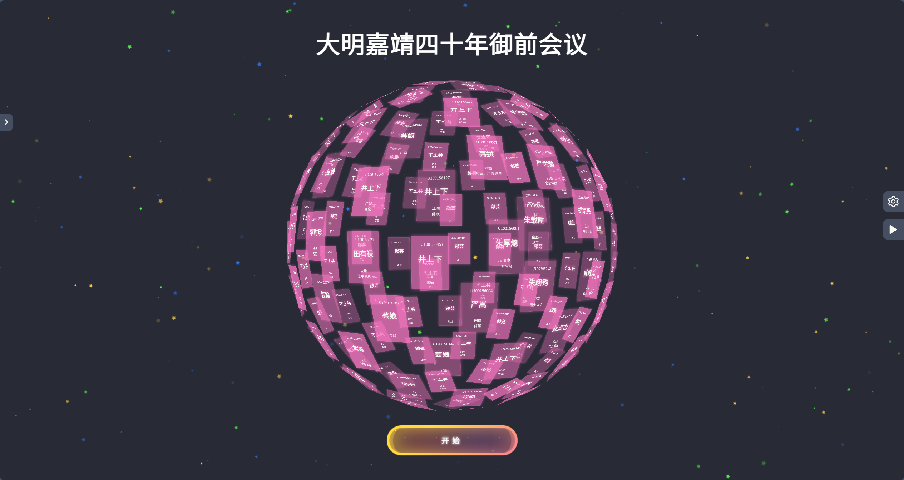
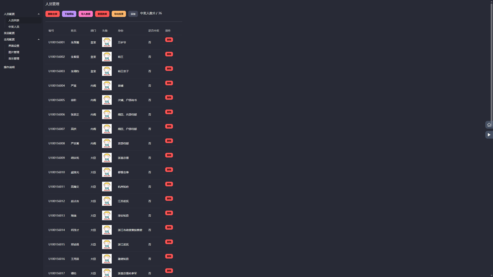
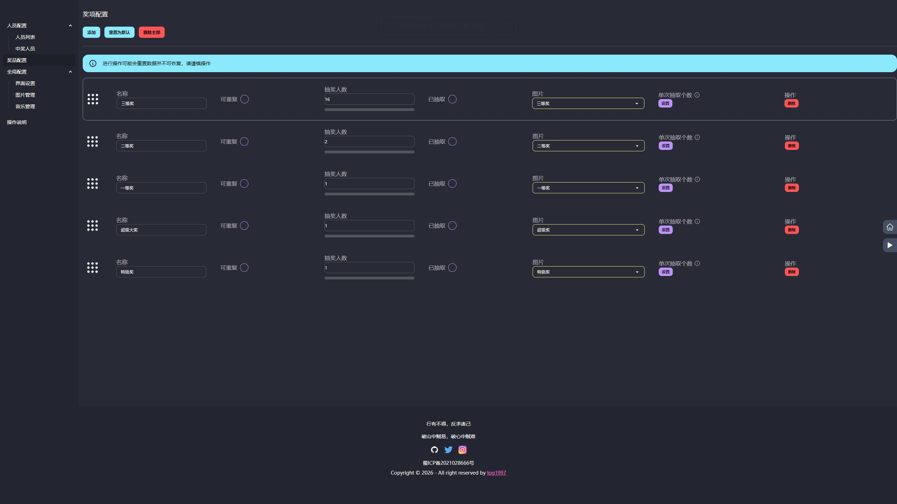
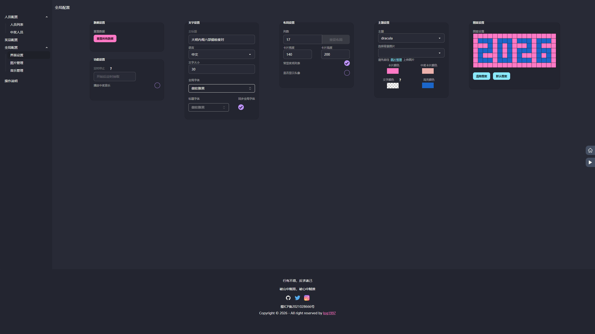
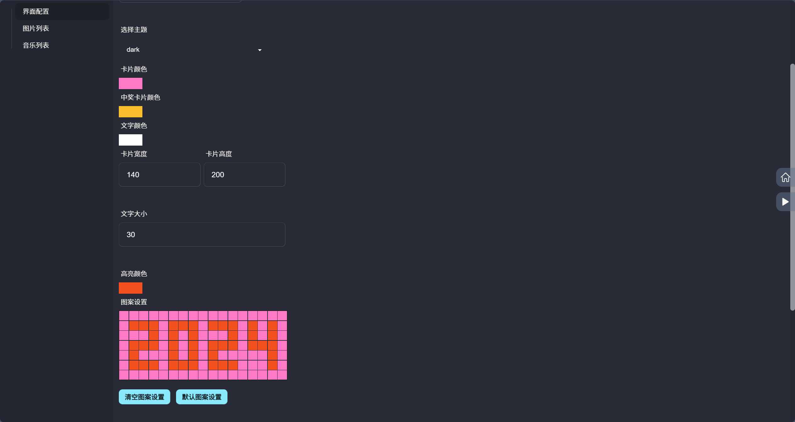
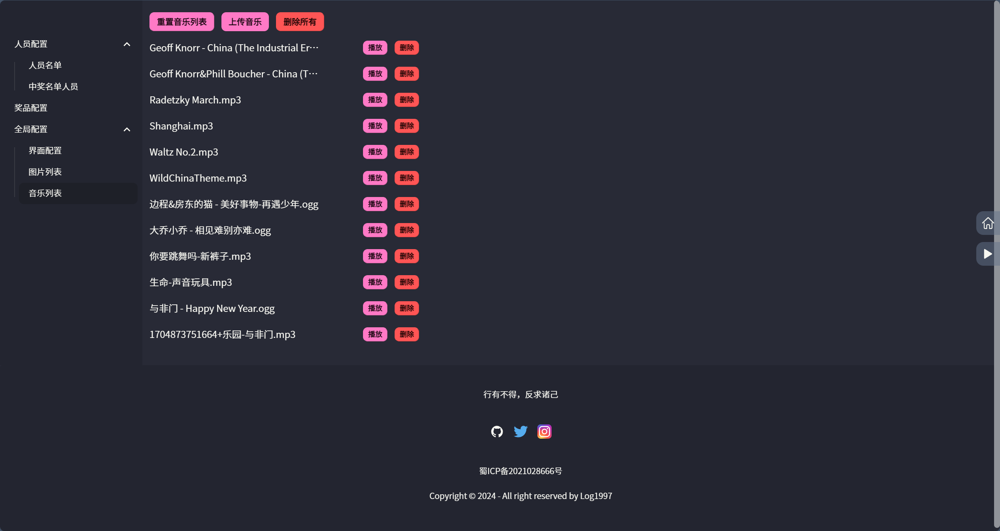

<p align="center">
    <a href="http://www.form-create.com">
        <svg t="1704902663531" class="icon" viewBox="0 0 1024 1024" version="1.1" xmlns="http://www.w3.org/2000/svg" p-id="4318" width="200" height="200"><path d="M433.230769 630.153846m-275.692307 0a275.692308 275.692308 0 1 0 551.384615 0 275.692308 275.692308 0 1 0-551.384615 0Z" fill="#E2FFFF" p-id="4319"></path><path d="M512 0C228.903385 0 0 228.903385 0 512s228.903385 512 512 512 512-228.903385 512-512S795.096615 0 512 0z m42.968615 938.653538V883.396923c0-27.608615-21.464615-46.040615-46.040615-46.040615-24.536615 0-46.040615 21.504-46.040615 46.08v55.21723c-196.450462-21.464615-356.036923-181.090462-377.540923-377.540923H140.603077c24.536615 0 46.040615-21.504 46.040615-46.08 0-24.536615-21.504-46.001231-46.08-46.00123H85.385846c18.392615-199.522462 178.018462-362.220308 377.540923-383.684923v61.36123c0 24.576 21.504 46.08 46.08 46.08 24.536615 0 46.001231-21.504 46.001231-46.08V85.346462c202.594462 21.464615 365.292308 181.090462 383.684923 383.684923h-61.361231c-27.648 0-46.08 18.392615-46.08 46.040615 0 24.536615 21.504 46.040615 46.08 46.040615h61.361231c-21.464615 199.522462-184.162462 359.148308-383.684923 377.540923z" fill="#437DFF" p-id="4320"></path><path d="M499.396923 291.170462a19.692308 19.692308 0 0 1 25.245539 0.039384l2.520615 2.520616 9.964308 12.169846C625.427692 414.208 669.538462 495.340308 669.538462 549.218462 669.538462 637.44 599.04 708.923077 512 708.923077s-157.538462-71.483077-157.538462-159.704615c0-49.900308 37.809231-123.155692 113.506462-219.72677l18.904615-23.630769 9.964308-12.130461a19.692308 19.692308 0 0 1 2.599385-2.56z m12.603077 110.434461l-9.570462 13.075692-13.23323 18.747077-11.815385 17.644308C447.763692 496.679385 433.230769 530.313846 433.230769 549.218462c0 44.937846 35.524923 80.935385 78.769231 80.935384 43.244308 0 78.769231-35.997538 78.769231-80.935384 0-16.305231-11.027692-43.992615-33.437539-81.053539l-10.318769-16.462769a790.843077 790.843077 0 0 0-11.697231-17.565539l-13.115077-18.668307-10.200615-13.863385z" fill="#437DFF" p-id="4321"></path></svg>
    </a>
</p>

# log-lottery 🚀🚀🚀🚀

[](https://github.com/LOG1997/log-lottery)
[](https://github.com/log1997)
[](https://github.com/log1997)

log-lottery是一个可配置可定制化的抽奖应用，炫酷3D球体，可用于年会抽奖等活动，支持奖品、人员、界面、图片音乐配置。

> 因原域名到期，现将原域名 (<https://24years.top/log-lottery>)
迁移到 (<https://1kw20.fun/log-lottery>) 。
如果进入网站遇到图片无法显示或有报错的情况，请先到【全局配置】-【界面配置】菜单中点击【重置所有数据】按钮清除数据后进行更新
请尽量拉取代码进行构建或部署，本线上网站会保持更新，可能影响原有功能和数据。

## 要求

使用PC端最新版Chrome或Edge浏览器。

访问地址：

<https://1kw20.fun/log-lottery>

or

<https://log1997.github.io/log-lottery/>

## TODO

- [x] 🕍 炫酷3D球体，年会抽奖必备，开箱即用
- [x] 💾 本地持久化存储
- [x] 🎁 奖品奖项配置
- [x] 👱 抽奖名单设置管理
- [x] 🎼 播放背景音乐
- [x] 🖼️ excel表格导入人员名单、抽奖结果使用excel导出
- [x] 🎈 可增加临时抽奖
- [x] 🧨 国际化多语言
- [x] 🍃 更换背景图片
- [ ] 🧵 卡片组成多种形状
- [ ] 添加docker构建部署和镜像

    ...
    需要更多功能请留言

## 详细介绍

### 配置参与人员

于人员配置管理界面下载excel模板，按要求填好数据后导入即可。

### 配置奖项

于奖项配置管理界面添加奖项后，自定义修改名称、抽取人数、是否全员参加、图片显示。

### 界面配置

可自定义配置标题、列数、卡片颜色、首页图案等。

### 图片和音乐管理

上传图片或音乐即可，数据使用indexdb在浏览器本地进行存储。

## 预览

首页





抽奖




配置









图片音乐配置




## 技术

- vue3
- threejs
- indexdb
- pinia
- daisyui

## 开发

安装依赖

```bash
pnpm i
or
npm install
```

开发运行

```bash
pnpm dev
or
npm run dev
```

打包

```bash
pnpm build
or
npm run build
```

预览

```bash
pnpm preview
or
npm run preview
```

若想直接以打开html文件的方式运行，请执行以下命令进行打包。打包完成后在dist目录中直接打开index.html即可。

```bash
pnpm build:file
or
npm run build:file
```

> 项目思路来源于 <https://github.com/moshang-xc/lottery>

## Docker支持

构建镜像

```bash
docker build -t log-lottery .
```

运行容器

```bash
docker run -d -p 9279:80 log-lottery
```

容器运行成功后即可在本地通过<http://localhost:9279/log-lottery/>访问

## License

[MIT](http://opensource.org/licenses/MIT)

Copyright (c) 2024-present log1997
