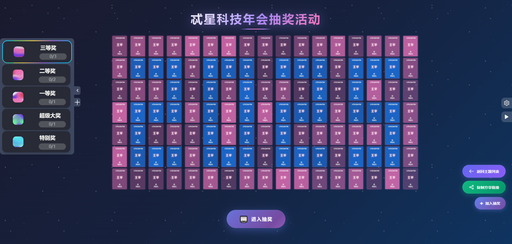
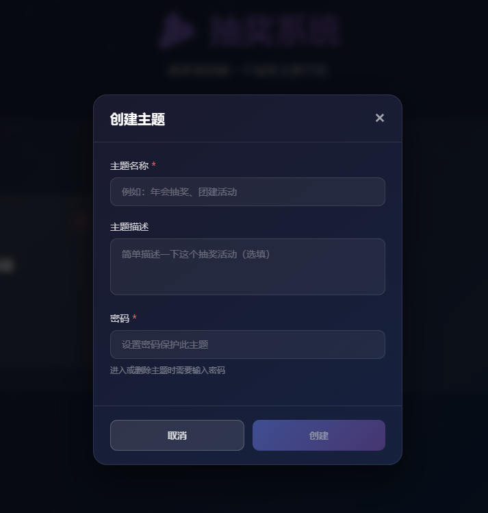
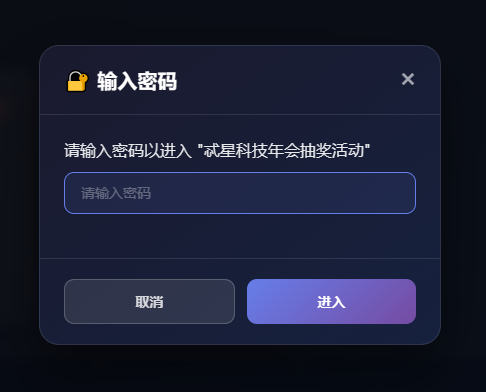
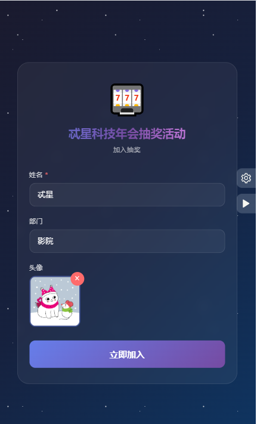
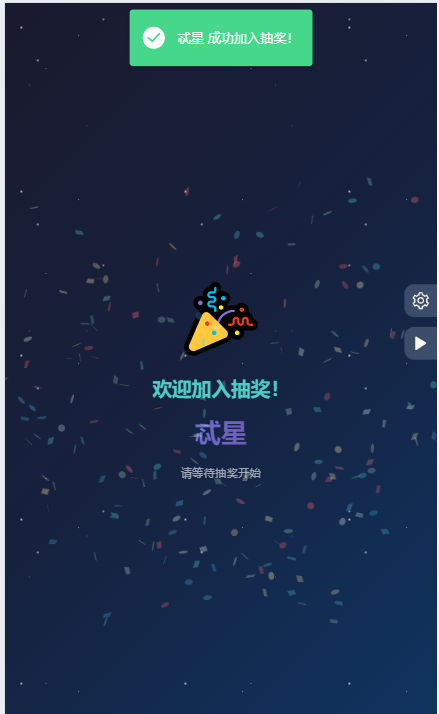

<div align="center">
    <a href="https://log1997.github.io/log-lottery/">
        
    </a>

# log-lottery 🚀🚀🚀🚀

[](https://github.com/LOG1997/log-lottery)
[](https://github.com/LOG1997/log-lottery)
[](https://github.com/log1997)
[](https://github.com/log1997)
[](https://github.com/log1997)

</div>

log-lottery是一个可配置可定制化的抽奖应用，炫酷3D球体，可用于年会抽奖等活动，支持奖品、人员、界面、图片音乐配置。

> 如果进入网站遇到图片无法显示或有报错的情况，请先到【全局配置】-【界面配置】菜单中点击【重置所有数据】按钮清除数据后进行更新。

> 该项目将在近期进行**内部代码重构**及**开发新功能**，预计元旦节前三天上线新版本。

## 要求

使用PC端最新版Chrome或Edge浏览器。

最新版体验地址：

[http://lottery.teixing.com](http://lottery.teixing.com)

访问地址：

<https://to2026.xyz/log-lottery>

or

<https://log1997.github.io/log-lottery/>

## TODO

- [x] 🕍 炫酷3D球体，年会抽奖必备，开箱即用
- [x] 💾 本地持久化存储
- [x] 🎁 奖品奖项配置
- [x] 👱 抽奖名单设置管理
- [x] 🎼 播放背景音乐
- [x] 🖼️ excel表格导入人员名单、抽奖结果使用excel导出
- [x] 🎈 可增加临时抽奖
- [x] 🧨 国际化多语言
- [x] 🍃 更换背景图片
- [x] 🚅 添加docker构建
- [x] 📚 添加服务器后端使用Sqllite数据库存储数据，用于多用户共享数据
- [x] 😳 增加分享抽奖页面链接，使用户可以主动加入抽奖名单
- [x] 🈶 增加主题功能，每个主题隔离数据，类似多租户
- [x] 📱  手机打开抽奖页面加入抽奖增加设备指纹 一个设备只能加入一次
- [x] 🐰 增加主题密码验证防止被其他用户删除
- [x] 😘 弹幕（开发中）
- [ ] 🧵 卡片组成多种形状
...
需要更多功能或发现bug请留言[issues](https://github.com/LOG1997/log-lottery/issues)

## 详细介绍

### 配置参与人员

于人员配置管理界面下载excel模板，按要求填好数据后导入即可。

### 配置奖项

于奖项配置管理界面添加奖项后，自定义修改名称、抽取人数、是否全员参加、图片显示。

### 界面配置

可自定义配置标题、列数、卡片颜色、首页图案等。

### 图片和音乐管理

上传图片或音乐即可，数据使用indexdb在浏览器本地进行存储。

## 预览

首页







抽奖







配置


图片音乐配置


## 技术

- vue3
- threejs
- indexdb
- pinia
- daisyui

## 开发

安装依赖

```bash
pnpm i
or
npm install
```

开发运行

```bash
pnpm dev
or
npm run dev
```

打包

```bash
pnpm build
or
npm run build
```

若想直接以打开html文件的方式运行，请执行以下命令进行打包。打包完成后在dist目录中直接打开index.html即可。

```bash
pnpm build:file
or
npm run build:file
```

> 项目思路来源于 <https://github.com/moshang-xc/lottery>

# 抽奖系统后端服务

这是一个基于 Node.js + SQLite 的轻量级后端服务，用于存储抽奖系统的数据，实现跨浏览器/设备数据共享。

## 安装

```bash
cd server
npm install
```

## 启动服务

```bash
# 生产模式
npm start

# 开发模式（自动重启）
npm run dev
```

服务将在 `http://localhost:3456` 启动。

## API 接口

### 主题管理
- `GET /api/themes` - 获取所有主题
- `GET /api/themes/:id` - 获取单个主题
- `POST /api/themes` - 创建主题
- `PUT /api/themes/:id` - 更新主题
- `DELETE /api/themes/:id` - 删除主题

### 人员配置
- `GET /api/themes/:themeId/person` - 获取人员配置
- `POST /api/themes/:themeId/person` - 保存人员配置

### 奖品配置
- `GET /api/themes/:themeId/prize` - 获取奖品配置
- `POST /api/themes/:themeId/prize` - 保存奖品配置

### 全局配置
- `GET /api/themes/:themeId/global` - 获取全局配置
- `POST /api/themes/:themeId/global` - 保存全局配置

## 数据存储

数据存储在 `server/lottery.db` SQLite 数据库文件中。

## 注意事项

1. 如果后端服务未启动，前端会自动降级使用 localStorage 存储
2. 建议在同一局域网内使用，确保所有设备都能访问后端服务
3. 如需外网访问，请配置相应的端口转发或使用 ngrok 等工具


## Docker支持

构建镜像

```bash
docker build -t log-lottery .
```

运行容器

```bash
docker run -d -p 9279:80 log-lottery
```

容器运行成功后即可在本地通过<http://localhost:9279/log-lottery/>访问

## Star History

[](https://star-history.com/#LOG1997/log-lottery&Date)

## License

[MIT](http://opensource.org/licenses/MIT)
